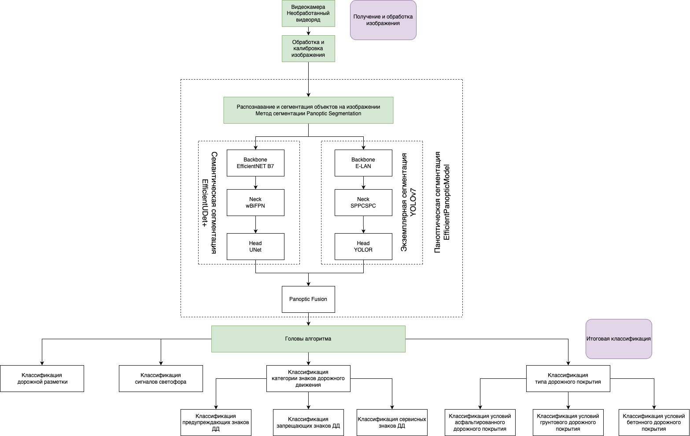
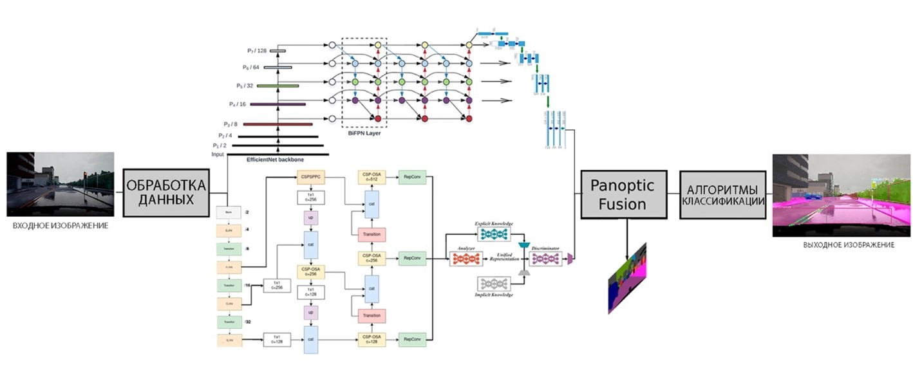
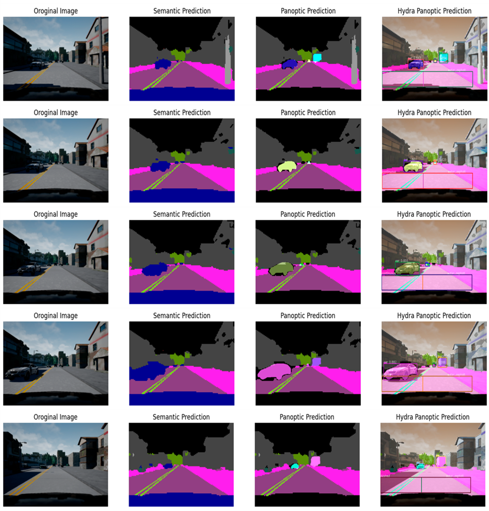

# PanopticHydraNet

Многие нейронные сети семантической сегментации представляют собой ансамбли моделей, например такие как EfficientUnet (EfficientNet + UNet), EfficientDet (EfficientNet + BiFPN) и другие. То же самое касается и алгоритмов паноптической сегментации. Внимательно анализируя архитектуру сущкествующих нейронных сетей, можно обратить внимание, что большинство имеет в своем структурном составе совокупность ранее исследованных алгоритмов.
Исходя из этого было принято решение для усовершенствования и увеличения точности работы разрабатываемого алгоритма, взять за основу методологию разработки наиболее эффективных алгоритмов паноптической сегментации, а также заменить структурные алгоритмы более продвинутыми, и составить из них единый ансамбль моделей, способный устранить все недостатки предыдущих поколений, в. Том числе проблему наложения масок объектов. Таким образом была разработана структурная схема алгоритма  «PanopticHydraNet», представленная на рисунке 1. 

 

Рисунок 1 – Структурная схема разрабатываемого алгоритма

В основу построения архитектуры данной модели легла совокупность методологий разработки двух наилучших алгоритмов паноптической сегментации.  Для достижения наивысших показателей качества модели было принято решение в качестве основных подсистем алгоритма взять две независимые модели, как это реализовано в алгоритме M-RCNN + PSPNet, но для объединения финальных предсказаний взять за основу метод архитектуры EffcientPS, чтобы окончательно устранить проблему наложения масок и повысить показатель качества работы модели.  

В качестве первого независимого алгоритма инстанс сегментации было принято решение взять новейший алгоритм YOLOv7, способный в значительной степени сократить время на обработку изображения, а также значительно повлиять на финальный показатель качества модели. 

В качестве алгоритма семантической сегментации была специально разработана новейшая архитектура нейросети EfficientUDet. Данный алгоритм представляет собой ансамбль моделей, где в качестве «хребта» выступает алгоритм EfficientNet седьмой версии, в качестве «шеи» выступает взвешенная двунаправленная пирамидальная нейросеть wBiFPN, а в качестве финальной головы сегментации выступает простейшая, но успевшая себя отлично зарекомендовать, архитектура UNet. 

В итоге общая структура алгоритма состоит из трех основных блоков:
1.	блок обработки входных данных,
2.	блок паноптической сегментации, 
3.	блок классификации.

Блок паноптической сегментации представляет собой совокупность нескольких алгоритмов, направленных на извлечение классов объектов, представленных на изображении. 
Он состоит из: 
1.	алгоритма семантической сегментации EfficientUDet,
2.	алгоритма экземплярной (instance) сегментации YOLOv7,
3.	блока объединения Panoptic Fusion.

Backbone – основная (базовая) сеть, служащая для извлечения признаков из поступающего на вход изображения.

Neck — это отдельный блок, который создан для того, чтобы агрегировать информацию от отдельных слоев с предыдущих блоков для увеличения аккуратности предсказания. 

Блок семантической сегментации – предназначен соответственно для семантической сегментации объектов на изображении. Под семантической сегментацией подразумевают способность алгоритма классифицировать определенный класс изображения и отделять его от остальных классов изображений путем наложения на него маски сегментации.

Блок экземплярной (инстанс) сегментации – подобен семантической сегментации, однако главное отличие данного бока заключается в том, что алгоритм детектирует, сегментирует и классифицирует каждый индивидуальный экземпляр класса на изображении.

Блок Panoptic Fusion – необходим для объединения алгоритмов экземплярной и сематической сегментаций. Это позволяет рассматривать индивидуально каждый объект на изображении.

Блок классификации («головы алгоритма») является финальным блоком алгоритма и представляет собой набор алгоритмов нейронных сетей, или ансамблей нейронных сетей, направленных на точную многоклассовую классификацию элементов дорожной инфраструктуры. К элементам дорожной инфраструктуры относятся знаки дорожного движения, светофоры, дорожное покрытие и дорожная разметка. 

Стоит отметить, что задача классификации и детектирования участников дорожного движения выполняется на этапе паноптической сегментации. Данный алгоритм способен классифицировать участников дорожного движения, а именно пешеходов, велосипедистов и транспортные средства, а также способен классифицировать транспортные средства по типу, на такие классы как трамвай, автобус, грузовой автомобиль, легковой автомобиль, мототранспорт. 

# Принцип работы разработанного алгоритма машинного зрения
Общий принцип работы разрабатываемого алгоритма паноптической сегментации представлен на рисунке 2. 
 

Рисунок 2 – Принцип работы разрабатываемого алгоритма паноптической сегментации

На вход в алгоритм подается необработанный видеоряд. Первым этапом выполняется обработка и калибровка изображения. Это позволяет стандартизировать входное изображение, и увеличить качество предсказания модели.

Следующим этапом, на основе полученных обработанных данных, выполняется распознавание и сегментация объектов на изображении. Для сегментации был разработан алгоритм паноптической сегментации, состоящий из двух составных элементов. В качестве первого составного элемента выступает разработанная в рамках данной ВКР нейронная сеть, выполняющая задачу семантической сегментации изображения – EfficientUDet. 

В качестве Backbone и Neck алгоритма семантической сегментации выбрана архитектура нейросети EfficientNet-B7 совместно со сверточной пирамидальной двунаправленной нейросетью wBiFPN. Подобный тандем позволяет разбивать полученное c камеры изображение на несколько фрагментов разного разрешения и масштаба с целью извлечения уникальных признаков объектов, расположенных на изображении.

Затем полученные признаки отправляются параллельно в голову алгоритма сегментации. В качестве головы алгоритма семантической сегментации выбрана архитектура UNet, позволяющая восстановить изображения до исходного масштаба и выполнить детектирование основных объектов на изображении по классам.  

Второй алгоритм, алгоритм YOLOv7, подобен по принципу работы предыдущему, но в отличие от прошлого выполняет задачу инстанс сегментации. Работа данного алгоритма позволяет разбить многоклассовые объекты (такие как автомобили, знаки и др.) на экземпляры. Благодаря тому, что данный алгоритм обрабатывает полученное изображение только один раз, значительно увеличивается скорость обработки всего видеоряда. Выходными параметрами данного алгоритма является прогноз класса, оценка достоверности, ограничивающая рамка и логиты маски.

Затем, с помощью блока Panoptic Fusion полученные данные объединяются в единое паноптическое предсказание по принципу, представленному в пункте два данной главы. 

Заключительным этапом параллельно включаются головы всего алгоритма. Каждая голова алгоритма выполняет собственную задачу, и представляет собой отдельный алгоритм или ансамбль алгоритмов машинного обучения, подобранный в зависимости от конкретной задачи. Каждый элемент изображения, принадлежащий тому или иному классу, отправляется на обработку в один из алгоритмов в зависимости от класса объекта. Входные изображения подвергаются первичной обработке. Выходными параметрами данного алгоритма является прогноз класса объекта.
Результатом работы разработанного алгоритма служит сегментированное изображение, на котором отмечены предсказанные классы объектов. Финальная архитектура разработанной нейронной сети представлена на рисунке 3.

  

Рисунок 3 – Архитектура разработанного алгоритма детектирования участников дорожного движения и элементов дорожной инфраструктуры

## Оценка результата работы

Таблица 1 – Сравнение разработанного алгоритма паноптической сегментации с существующими по метрике mIoU
Наименование модели | IoU, %
------------- | ------------- 
Axial-DeepLab-L	| 68,4
WeaklySupervised	| 71,6
EfficientPanopticModel - B0	| 73,64
UPSNet	| 75,2
EfficientPanopticModel - B1	| 75,55
AUNet	| 75,6
Panoptic FPN	| 75,7
EfficientPanopticModel - B2	| 76,51
Seamless	| 77,5
EfficientPanopticModel - B3	| 77,94
EfficientPanopticModel - B4	| 79,18
AdaptIS	| 79,2
EfficientPS	| 79,3
DINetwork	| 79,8
EfficientPanopticModel - B5	| 79,85
Panoptic-DeepLab	| 80,5
M-RCNN + PSPNet	| 80,9
EfficientPanopticModel - B6	| 80,9
OneFormer	| 83,1
EfficientPanopticModel - B7	| 83,37

Таблица 2 – Сравнение разработанного алгоритма паноптической сегментации с существующими по метрике PQ

Наименование модели	| PQ, %
------------- | ------------- 
Axial-DeepLab-L	| 41,1
WeaklySupervised	| 47,3
DINetwork	| 55,4
TASCNet	| 55,9
DeeperLab	| 56,3
EfficientPanopticModel - B0	| 57,11
Panoptic FPN	| 58,1
EfficientPanopticModel - B1	| 58,59
AUNet	| 59
UPSNet	| 59,3
EfficientPanopticModel - B2	| 59,33
Seamless	| 60,3
EfficientPanopticModel - B3	| 60,44
SSAP	| 61,1
M-RCNN + PSPNet	| 61,2
EfficientPanopticModel - B4	| 61,41
EfficientPanopticModel - B5	| 61,92
AdaptIS	| 62
EfficientPanopticModel - B6	| 62,73
EfficientPanopticModel - B7	| 64,78
Panoptic-DeepLab	| 67,1
OneFormer	| 67,6
EfficientPS	| 67,8

Из таблиц 1–2 видно, что разработанный алгоритм имеет сопоставимые показатели точности и может превосходить большинство современных решений. При этом данный алгоритм, в отличие от существующих, способен выполнять детектирование 250 классов в рамках поставленной задачи, а благодаря меньшему числу параметров значительно снижает нагрузку на вычислительные процессоры, что отражено в таблице 3, и как следствие имеет большую скорость обработки информации, что отражено в таблице 4. 

Таблица 3 – Сравнение разработанного алгоритма паноптической сегментации с существующими по числу обучаемых параметров
Наименование модели	| Параметры, млн 
------------- | ------------- 
mIoU > 68
EfficientPanopticModel - B0	| 45,2
UPSNet	| 45,5
Axial-DeepLab-L	| 45,8
TASCNet	| 51,8
DeeperLab	| 61,9
DINetwork	| 64
mIoU > 75
EfficientPanopticModel - B1	| 46,6
EfficientPanopticModel - B2	| 47,9
Seamless	| 51,43
EfficientPanopticModel - B3	| 51,7
EfficientPanopticModel - B4	| 59,9
AUNet	| 69,9
SSAP	| 78,06
Panoptic FPN	| 216
mIoU > 80
EfficientPS	| 40,89
Panoptic-DeepLab	46,73
EfficientPanopticModel - B5	| 68,0
AdaptIS	| 75,4
EfficientPanopticModel - B6	| 84,2
M-RCNN + PSPNet	92,0
EfficientPanopticModel - B7	| 98,3
OneFormer	| 223

Таблица 4 – Сравнение разработанного алгоритма паноптической сегментации с существующими по времени на обработку
Наименование модели	| Время, мс
------------- | ------------- 

EfficientPanopticModel 	| 146
EfficientPS	| 166
Seamless	| 168
Panoptic-DeepLab	| 175
UPSNet	| 202
OneFormer	| 336
DeeperLab	| 463
M-RCNN + PSPNet	| 531

На рисунке 4 представлена визуализация результатов выполнения поставленной задачи разработанной архитектурой.
  
